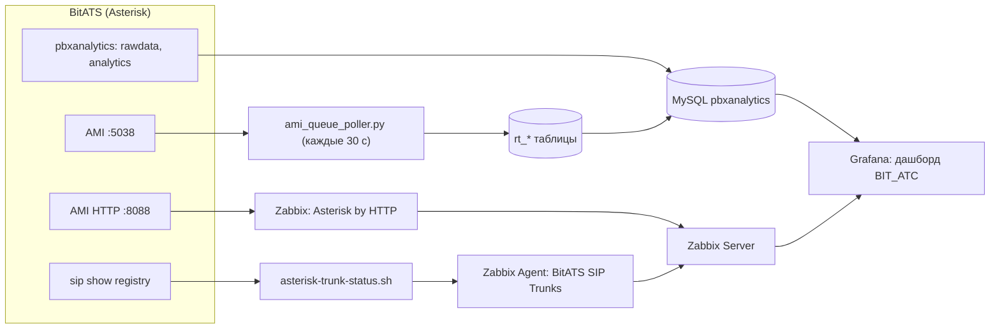

# BitATS: мониторинг звонков колл-центра (Zabbix + Grafana + MySQL)

Система мониторинга для АТС BitATS (Asterisk): показатели звонков и очередей, статус операторов в реальном времени и состояние SIP-транков. Данные о завершённых звонках берутся из штатной аналитики BitATS, состояние очередей собирает самописный AMI-поллер на Python, транки и активные звонки отслеживает Zabbix, всё выводится на дашборде Grafana.

## Стек

- BitATS / BitPBX на Asterisk 16 (chan_sip), MySQL / MariaDB
- pbxanalytics (Java-модуль аналитики, поставляется с BitATS)
- Python 3 + `mysql-connector-python` (AMI-поллер)
- Zabbix 7.0: официальный шаблон `Asterisk by HTTP`, собственный шаблон `BitATS SIP Trunks`, Zabbix Agent (LLD-скрипт для транков)
- Grafana 11.x + плагин Zabbix (alexanderzobnin) + MySQL datasource
- systemd

## Схема



## Что показывает дашборд

- Итоги за период: всего звонков, отвечено, пропущено, % пропущенных, повторные, средняя длительность, Service Level (ответ за 20 с), максимальное ожидание
- Онлайн: звонки в очереди сейчас, активные разговоры
- Отвеченные и пропущенные на круговой диаграмме
- Таблица операторов: принято, средняя длительность разговора, сколько раз звонили, процент поднятия
- Статус SIP-транков (Registered / Rejected / другие) с подсветкой

## Структура репозитория

```
bitats-call-monitoring/
├── README.md
├── pbxanalytics/
│   ├── pbxanalytics.service          # systemd-юнит штатной аналитики
│   └── pbxanalytics.conf.example     # шаблон конфига (без паролей)
├── sql/schema.sql                    # таблицы rt_*, права пользователей
├── poller/
│   ├── ami_queue_poller.py           # AMI-поллер очередей и операторов
│   ├── ami-queue-poller.service      # systemd-юнит поллера
│   └── ami-queue-poller.env.example  # шаблон файла с параметрами AMI
├── zabbix/
│   ├── asterisk-trunk-status.sh      # скрипт LLD и статуса транков
│   ├── asterisk-trunks.conf          # UserParameter для агента (транки)
│   ├── asterisk-calls.conf           # UserParameter: число активных звонков операторов
│   └── bitats_sip_trunks_template.yaml  # шаблон Zabbix для транков
└── grafana/bit_atc_dashboard.json    # дашборд (экспорт для импорта)
```

## Содержание

1. [Предпосылки](#шаг-1-предпосылки)
2. [Штатная аналитика pbxanalytics](#шаг-2-штатная-аналитика-pbxanalytics)
3. [Таблицы реального времени](#шаг-3-таблицы-реального-времени-rt_)
4. [AMI-поллер очередей](#шаг-4-ami-поллер-очередей)
5. [Zabbix: транки и активные звонки](#шаг-5-zabbix-транки-и-активные-звонки)
6. [Grafana](#шаг-6-grafana)
7. [Проверка всей цепочки](#шаг-7-проверка-всей-цепочки)
8. [Как считаются показатели](#шаг-8-как-считаются-показатели)
9. [Траблшутинг](#шаг-9-траблшутинг)
10. [Что можно улучшить](#что-можно-улучшить)

> `<...>`, `CHANGE_ME` в примерах это плейсхолдеры. Пароли, секреты AMI и адреса подставляй свои и не храни их в репозитории.

---

## Шаг 1. Предпосылки

- Установленная BitATS. Если она установлена, штатный модуль аналитики уже есть, и его настройки можно использовать как основу (шаг 2 тогда сводится к проверке).
- Доступ к MySQL с правами создания таблиц в БД `pbxanalytics`.
- Работающий Zabbix Server 7.0 и Grafana.
- Asterisk на chan_sip. Скрипт статуса транков опирается на команду `sip show registry` и с PJSIP не работает.

---

## Шаг 2. Штатная аналитика pbxanalytics

Модуль (Java) читает таблицу `pbxanalytics.rawdata` и строит агрегированную `pbxanalytics.analytics`, из которой дашборд берёт статистику по завершённым звонкам.

Проверка, что он уже работает:

```bash
systemctl status pbxanalytics
```

Если юнита нет, создай `/etc/systemd/system/pbxanalytics.service` по образцу из [`pbxanalytics/pbxanalytics.service`](pbxanalytics/pbxanalytics.service) и положи конфиг `/etc/bitpbx/pbxanalytics.conf` по шаблону [`pbxanalytics.conf.example`](pbxanalytics/pbxanalytics.conf.example):

```bash
sudo systemctl daemon-reload
sudo systemctl enable --now pbxanalytics
```

Права пользователю модуля. `GRANT` не принимает несколько таблиц через запятую в одной команде: права выдаются либо на всю базу, либо отдельной командой на каждую таблицу.

```sql
GRANT ALL ON pbxanalytics.rawdata   TO 'analyticsUser'@'localhost';
GRANT ALL ON pbxanalytics.analytics TO 'analyticsUser'@'localhost';
FLUSH PRIVILEGES;
```

Перед изменением прав и паролей сделай резервную копию БД.

---

## Шаг 3. Таблицы реального времени (rt_*)

Штатная аналитика хранит только завершённые звонки. Для текущего состояния очередей и операторов нужны три дополнительные таблицы, их наполняет поллер. Создай их скриптом [`sql/schema.sql`](sql/schema.sql):

```bash
sudo mysql pbxanalytics < sql/schema.sql
```

| Таблица | Что хранит |
|---|---|
| `rt_queue_status` | звонки в очереди, максимальное ожидание, свободные, занятые и поставившие паузу операторы |
| `rt_member_status` | статус каждого оператора: очередь, номер, имя, пауза, статус AMI |
| `rt_queue_entries` | звонки, стоящие в очереди: позиция, номер звонящего, время ожидания |

---

## Шаг 4. AMI-поллер очередей

Скрипт каждые 30 секунд запрашивает у Asterisk `QueueStatus` по AMI и записывает состояние очередей и операторов в таблицы `rt_*`.

### 4.1. Пользователь AMI

В `/etc/asterisk/manager.conf` создай пользователя с правами `system,call,agent` на чтение и запись:

```ini
[bitpbx]
secret = CHANGE_ME
read = system,call,agent
write = system,call,agent
permit = 127.0.0.1/255.255.255.255
```

Примени: `sudo asterisk -rx "manager reload"`.

### 4.2. Установка

```bash
pip3 install mysql-connector-python
sudo cp poller/ami_queue_poller.py /opt/ami_queue_poller.py
```

В `QUEUE_MAP` внутри скрипта пропиши соответствие номеров очередей в AMI и их добавочных для своей АТС. Параметры доступа к AMI поллер читает из переменных окружения:

```bash
sudo cp poller/ami-queue-poller.env.example /etc/ami-queue-poller.env
sudo nano /etc/ami-queue-poller.env      # вписать пароль AMI-пользователя
sudo chmod 600 /etc/ami-queue-poller.env
```

Запись в БД идёт через unix-сокет от имени root, поэтому служба запускается от root.

### 4.3. Служба

```bash
sudo cp poller/ami-queue-poller.service /etc/systemd/system/
sudo systemctl daemon-reload
sudo systemctl enable --now ami-queue-poller
journalctl -u ami-queue-poller -f
```

В журнале раз в 30 секунд должна появляться строка вида `HH:MM:SS | queues=N members=M waiting={...}`. Строка `ERROR: ...` означает проблему с доступом к AMI или БД.

Как разбирается статус оператора: `paused=1` значит на паузе (приоритет), статус AMI `1` свободен, `2` и `6` в разговоре, остальное недоступен. Номер оператора извлекается регулярным выражением из поля `StateInterface` (`hint:q<номер>@...`).

---

## Шаг 5. Zabbix: транки и активные звонки

Zabbix решает две задачи: следит за регистрацией SIP-транков (собственный шаблон) и отдаёт число активных звонков и звонков в очереди (официальный шаблон Asterisk).

### 5.1. Скрипт статуса транков на сервере АТС

```bash
sudo cp zabbix/asterisk-trunk-status.sh /usr/local/bin/asterisk-trunk-status.sh
sudo chmod +x /usr/local/bin/asterisk-trunk-status.sh
```

`chmod +x` делает файл исполняемым (аналог bat-файла в Windows). Скрипт умеет два режима:

- `discover` выдаёт JSON со списком зарегистрированных транков (`{#TRUNK_USER}`, `{#TRUNK_HOST}`) для низкоуровневого обнаружения (LLD) в Zabbix;
- `status <транк>` выводит состояние: `Registered`, `Rejected`, `Request Sent`, `UNKNOWN` или текст статуса.

### 5.2. Права для пользователя zabbix

Скрипт вызывает `sudo asterisk -rx "sip show registry"`, поэтому пользователю `zabbix` нужно разрешить эту команду без пароля:

```bash
sudo visudo
```

В самый низ файла добавь:

```
# for zabbix user special rules
zabbix ALL=(ALL) NOPASSWD: /usr/sbin/asterisk
```

### 5.3. Параметры пользователя агента

Два файла кладутся в каталог дополнительных параметров агента. [`zabbix/asterisk-trunks.conf`](zabbix/asterisk-trunks.conf) связывает ключи Zabbix со скриптом статуса транков:

```
UserParameter=asterisk.trunk.discover,/usr/local/bin/asterisk-trunk-status.sh discover
UserParameter=asterisk.trunk.status[*],/usr/local/bin/asterisk-trunk-status.sh status $1
```

[`zabbix/asterisk-calls.conf`](zabbix/asterisk-calls.conf) добавляет ключ `asterisk.calls.irkutsk`: он считает активные каналы операторов (по добавочным `399xx`) через консоль Asterisk. Префикс `399` замени на свой:

```
UserParameter=asterisk.calls.irkutsk,sudo /usr/sbin/asterisk -rx "core show channels" | grep -E "(SIP|PJSIP|Local)/399[0-9]{2}" | wc -l
```

Команда вызывает `sudo`, поэтому нужны права из п. 5.2. Считаются каналы, а не звонки: если один звонок занимает несколько каналов (например, `Local`), число получится больше.

Для Zabbix Agent 2:

```bash
sudo cp zabbix/asterisk-trunks.conf zabbix/asterisk-calls.conf /etc/zabbix/zabbix_agent2.d/
sudo systemctl restart zabbix-agent2
```

Версия агента (1 или 2) на логику не влияет, отличается только путь: для первого агента каталог `/etc/zabbix/zabbix_agentd.d/` и служба `zabbix-agent`.

Проверка с сервера Zabbix:

```bash
zabbix_get -s <IP_АТС> -k asterisk.trunk.discover
zabbix_get -s <IP_АТС> -k asterisk.calls.irkutsk
```

### 5.4. Шаблон для транков

В веб-интерфейсе Zabbix: **Data collection → Templates → Import** и загрузи [`zabbix/bitats_sip_trunks_template.yaml`](zabbix/bitats_sip_trunks_template.yaml). Шаблон `BitATS SIP Trunks` содержит:

- правило обнаружения `SIP Trunk Discovery` (ключ `asterisk.trunk.discover`, период 5 минут);
- прототип элемента данных `Trunk {#TRUNK_USER} ({#TRUNK_HOST}) status` (ключ `asterisk.trunk.status[{#TRUNK_USER}]`, опрос раз в 30 секунд, тип «символьный»);
- прототип триггера `Trunk {#TRUNK_USER} is not Registered ({#TRUNK_HOST})` (приоритет High): срабатывает, если статус отличается от `Registered`.

### 5.5. Официальный шаблон Asterisk by HTTP

Шаблон `Asterisk by HTTP` уже входит в поставку Zabbix 7.0, отдельно импортировать не нужно. Он получает метрики Asterisk через мини-HTTP-сервер AMI. Со стороны Asterisk нужно:

- включить мини-HTTP-сервер (`http.conf`, `enabled=yes`);
- в разделе general файла `manager.conf` указать `webenabled=yes`;
- создать AMI-пользователя с правами `system` и `command` на запись.

### 5.6. Хост в Zabbix

Создай хост для АТС (в примере `BitATS`):

- шаблоны: `Asterisk by HTTP`, `BitATS SIP Trunks`, `Linux by Zabbix agent`;
- группа узлов, например `ATS` (имя пригодится в запросах Grafana);
- интерфейс Agent: IP сервера АТС, порт `10050`;
- макросы узла сети:

| Макрос | Значение |
|---|---|
| `{$AMI.HOST}` | адрес сервера АТС |
| `{$AMI.PORT}` | порт AMI, `5038` |
| `{$AMI.URL}` | `http://<адрес АТС>:8088/rawman` |
| `{$AMI.USERNAME}` | логин AMI-пользователя (если не задан в самом шаблоне) |
| `{$AMI.SECRET}` | пароль AMI-пользователя (хранить как секретный макрос) |

Проверка: в хосте открой правило `SIP Trunk Discovery` → прототипы элементов данных и убедись, что ключ и имя такие, как в п. 5.4. Если шаблон импортировался неверно, это видно здесь. Затем в **Monitoring → Latest data** должны появиться элементы `Trunk ... status` по каждому транку.

### 5.7. Элемент «Active calls (Irkutsk)»

Панель «Активные разговоры» на дашборде читает отдельный элемент данных, который создаётся на самом хосте (не в шаблоне): **Hosts → твой хост → Items → Create item**.

| Поле | Значение |
|---|---|
| Имя | `Active calls (Irkutsk)` |
| Тип | Zabbix agent |
| Ключ | `asterisk.calls.irkutsk` |
| Тип информации | Числовой (целое положительное) |
| Интервал обновления | `5s` |
| История / динамика изменений | хранить 31 день / 365 дней |

Проверка: в **Latest data** значение появляется и меняется во время разговоров. Пока идут разговоры операторов, оно больше нуля.

Официальный шаблон даёт свой элемент `Active calls` (ключ `asterisk.active_calls`, данные берутся по AMI HTTP). Он тоже подойдёт для панели, если поменять в ней имя элемента.

---

## Шаг 6. Grafana

### 6.1. Плагин и источники данных

1. Установи плагин Zabbix (`alexanderzobnin-zabbix-app`) и включи его.
2. Создай источник данных **Zabbix**: URL API `http://<Zabbix>/api_jsonrpc.php`, пользователь с правом чтения нужного хоста.
3. Создай источник данных **MySQL**: сервер АТС, база `pbxanalytics`. Для подключения лучше завести пользователя только на чтение (закомментированный пример в [`sql/schema.sql`](sql/schema.sql)).

### 6.2. Импорт дашборда

**Dashboards → New → Import** и загрузи [`grafana/bit_atc_dashboard.json`](grafana/bit_atc_dashboard.json). Импорт попросит выбрать два источника данных (MySQL и Zabbix), выбери созданные в п. 6.1.

Дашборд собран под Grafana 11.6 и плагин Zabbix 6.4.1, обновляется раз в минуту, период по умолчанию 3 часа.

### 6.3. Что подправить под свою АТС

В запросах дашборда остались значения, зависящие от конкретной АТС. Открой панель → Edit и замени:

- **Zabbix-панели** («В очереди сейчас», «Активные разговоры», «Статус транков»): группа `ATS` и хост `BITATS` должны совпадать с именами в твоём Zabbix. Панель «Активные разговоры» ищет элемент `Active calls (Irkutsk)`. Это отдельный элемент, который создаётся на хосте по п. 5.7. Если ты его не создавал, выбери в панели стандартный элемент `Active calls` из шаблона Asterisk by HTTP.
- **Исключаемые номера**: в панелях «Всего звонков», «% пропущенных», «Отвеченные / Пропущенные», «Пропущено» стоит `dialedext NOT IN ('EXCLUDED_NUMBER_1', 'EXCLUDED_NUMBER_2')`. Впиши номера, которые не должны попадать в статистику колл-центра (например, служебные), либо убери условие.
- **Префиксы добавочных**: `answeredext LIKE '399%'` (добавочные операторов) и `dialedext NOT LIKE '400%'` (набранные номера с этим префиксом исключаются из статистики). Замени на свои.
- **Таблица «Операторы - итог за период»**: список `r.ext IN ('10001', '10002', '10003')` это пример, впиши номера своих операторов. Панель показывает только операторов из списка, у которых были звонки за период.

---

## Шаг 7. Проверка всей цепочки

```bash
systemctl status pbxanalytics ami-queue-poller zabbix-agent2
sudo asterisk -rx "sip show registry"        # ожидаемые транки в состоянии Registered
```

Свежесть данных поллера (отставание должно быть порядка периода опроса, 30 секунд):

```sql
SELECT MAX(ts), TIMESTAMPDIFF(SECOND, MAX(ts), NOW()) AS lag_sec FROM pbxanalytics.rt_queue_status;
SELECT MAX(ts), TIMESTAMPDIFF(SECOND, MAX(ts), NOW()) AS lag_sec FROM pbxanalytics.rt_member_status;
```

В Zabbix новые элементы по транкам появились и не в состоянии «Не поддерживается». В Grafana на дашборде отображаются данные, а панель статуса транков подсвечивает `Registered` зелёным.

---

## Шаг 8. Как считаются показатели

| Панель | Как считается |
|---|---|
| Всего звонков | `COUNT(*)`, из отвеченных берутся только принятые операторами (`answeredext LIKE '399%'`), плюс звонки без ответившего; исключаются заданные номера и набранные номера с префиксом `400` |
| Отвечено | `COUNT(DISTINCT uniqueid)` для `disposition = 'ANSWERED'` и `answeredext LIKE '399%'` |
| Пропущено, % пропущенных | `disposition = 'NOANSWERED'` без исключаемых номеров; процент считается от всех звонков за вычетом тех же исключений |
| Отвеченные / Пропущенные | сумма по `ANSWERED` и `NOANSWERED` без исключаемых номеров |
| Повторные | `COUNT(src) - COUNT(DISTINCT src)`: звонки с уже встречавшихся номеров |
| Ср. длительность | среднее `billsec` по отвеченным |
| SL, ответ за 20 с | доля отвеченных, у которых `duration - billsec <= 20` |
| Макс. ожидание | `MAX(duration - billsec)` |
| Операторы, итог за период | `rt_member_status` присоединяется к `analytics` по `answeredext` (`modulename = 'users'`): принято, среднее время разговора, всего звонило, процент поднятия |
| В очереди сейчас | Zabbix, элемент `Callers` официального шаблона |
| Активные разговоры | Zabbix, элемент с числом активных звонков |
| Статус транков | Zabbix, элементы `Trunk ... status` |

Все запросы к `analytics` фильтруют входящие звонки (`direction = 'incoming'`, `modulename = 'call'`) за выбранный период (`$__timeFilter(calldate)`).

---

## Шаг 9. Траблшутинг

**`GRANT` выдаёт ошибку синтаксиса.** MySQL не принимает несколько таблиц через запятую в одной команде `GRANT`. Выдавай права отдельной командой на каждую таблицу или на всю базу, затем `FLUSH PRIVILEGES` (шаг 2).

**Поллер пишет `ERROR: ...` или не запускается.**
- `KeyError: 'AMI_PASS'`: не подхватился файл `/etc/ami-queue-poller.env` (проверь путь в юните и права).
- Ошибка соединения или авторизации: проверь адрес и порт AMI, логин и пароль в `manager.conf`, выполни `manager reload`.
- Ошибка записи в БД: проверь, что таблицы `rt_*` созданы (шаг 3).

**Статус транка `UNKNOWN`.** Транка нет в выводе `sip show registry`: он не регистрируемый или имя не совпало. Скрипт работает только с chan_sip.

**Элементы по транкам «Не поддерживается».** Чаще всего у пользователя `zabbix` нет права на команду `asterisk` через sudo (шаг 5.2). Проверка: `sudo -u zabbix sudo /usr/sbin/asterisk -rx "sip show registry"` не должна спрашивать пароль.

**Discovery не находит транки.** Проверь путь к каталогу параметров агента (для агента 2 и агента 1 он разный), перезапусти агент и выполни `zabbix_get ... -k asterisk.trunk.discover`.

**Панели Zabbix в Grafana пустые.** Имена группы и хоста в запросе панели не совпадают с Zabbix (п. 6.3).

**Панель операторов пустая.** В запросе стоит пример списка номеров (`10001`, `10002`, `10003`): впиши номера своих операторов (п. 6.3). Либо поллер не пишет данные (шаг 7).

---

## Что можно улучшить

- **Очистка таблиц `rt_*`.** Поллер добавляет снимок каждые 30 секунд, и без чистки таблицы растут бесконечно, а запросы дашборда замедляются. Например, ежедневное удаление старых записей:

  ```sql
  DELETE FROM pbxanalytics.rt_queue_status  WHERE ts < NOW() - INTERVAL 7 DAY;
  DELETE FROM pbxanalytics.rt_member_status WHERE ts < NOW() - INTERVAL 7 DAY;
  DELETE FROM pbxanalytics.rt_queue_entries WHERE ts < NOW() - INTERVAL 7 DAY;
  ```

- **Точнее считать активные звонки.** Ключ `asterisk.calls.irkutsk` считает каналы `SIP`, `PJSIP` и `Local` с добавочными операторов. Если у одного звонка несколько таких каналов, он посчитается несколько раз. Плюс скрипт вызывает `sudo asterisk` каждые 5 секунд.
- **Отдельный пользователь БД для поллера** вместо root через сокет.
- **Сузить права sudo** для `zabbix` до одной команды: `zabbix ALL=(root) NOPASSWD: /usr/sbin/asterisk -rx sip show registry` (проверить через `sudo -l -U zabbix`). Сейчас разрешён весь `/usr/sbin/asterisk`.
- **`QUEUE_MAP` вынести из кода**: сейчас соответствие очередей и добавочных зашито в скрипт, при изменении очередей его нужно править вручную.
- **Триггеры Zabbix по очередям** (число звонков в ожидании, время ожидания, целевой SLA) пока не настроены: пороги должны определяться бизнесом, а не выбираться наугад.
- **Одинаковые фильтры во всех панелях.** Исключения номеров и префиксов сейчас заданы только в части запросов (например, в «Всего звонков» и «% пропущенных» есть, а в «SL» и «Макс. ожидание» нет), поэтому цифры на разных панелях считаются по немного разным выборкам. Лучше вынести условия в общую переменную или представление (view) в БД.
- Вынести пороги цветов и определения (`NOANSWERED`, окно SL 20 секунд) в переменные дашборда.
